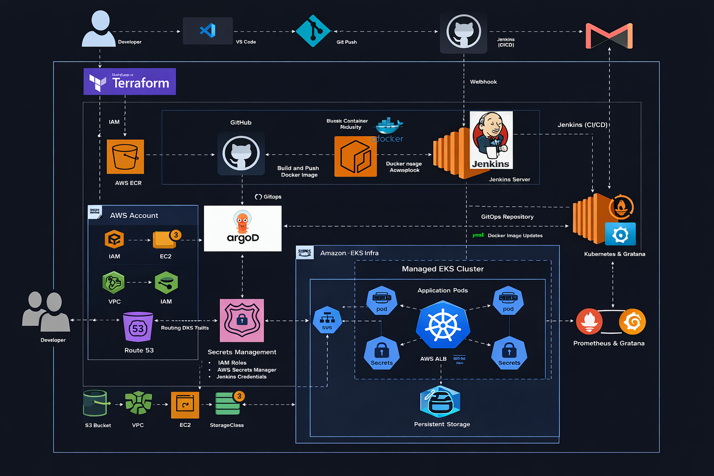

# StreamOps DevSecOps Platform 

## Overview

This project demonstrates an end-to-end DevSecOps pipeline built on AWS, covering the complete lifecycle from infrastructure provisioning to automated deployment using a GitOps approach.

The goal of this project was to understand how modern cloud-native applications are built, deployed, and managed using industry-standard DevOps tools and practices.

---

## Architecture

The following diagram represents the complete DevSecOps workflow of the platform, from code commit to deployment and monitoring.

<p align="center">
  
</p>

---

## Tech Stack

### Infrastructure

* AWS (EKS, ECR, EC2, VPC, IAM)
* Terraform (Infrastructure as Code)

### CI/CD & GitOps

* Jenkins (CI Pipeline)
* ArgoCD (GitOps Deployment)
* GitHub (Source + GitOps Repo)

### Containerization & Orchestration

* Docker
* Kubernetes (EKS)

### Monitoring

* Prometheus
* Grafana

---

## How It Works

1. Developer pushes code to GitHub
2. Jenkins pipeline is triggered automatically
3. Docker image is built and pushed to AWS ECR
4. Jenkins updates Kubernetes manifests in GitOps repository
5. ArgoCD detects changes and deploys to Kubernetes
6. Application runs on EKS cluster
7. Monitoring is handled via Prometheus and Grafana

---

## Project Structure

```
streamops-devsecops-platform/
├── app/              # Application source code
├── jenkins/          # Jenkins pipeline & Dockerfile
├── kubernetes- ArgoCD/       # Kubernetes manifests
├── infra/            # Terraform infrastructure
└── README.md
```

---

## Key Features

* End-to-end CI/CD pipeline using Jenkins
* GitOps-based deployment using ArgoCD
* Containerized application using Docker
* Kubernetes deployment on AWS EKS
* Infrastructure provisioning using Terraform
* Scalable and production-style architecture
* Monitoring setup using Prometheus and Grafana

---

## What I Learned

* Designing a complete DevOps pipeline from scratch
* Implementing GitOps workflow using ArgoCD
* Managing container lifecycle with Docker and Kubernetes
* Working with AWS services for real-world deployment
* Understanding monitoring and observability concepts

---

## Future Improvements

* Add automated security scanning (Trivy / OWASP)
* Implement Helm charts for Kubernetes deployments
* Improve CI/CD with multi-environment support
* Add alerting system for failures

---

## Notes

This project focuses on understanding the complete DevOps workflow and integrating multiple tools together in a practical setup. The emphasis was on building a working pipeline and understanding how each component interacts in a real-world system.

---

Developed as a hands-on DevSecOps project to demonstrate real-world cloud and automation practices.
